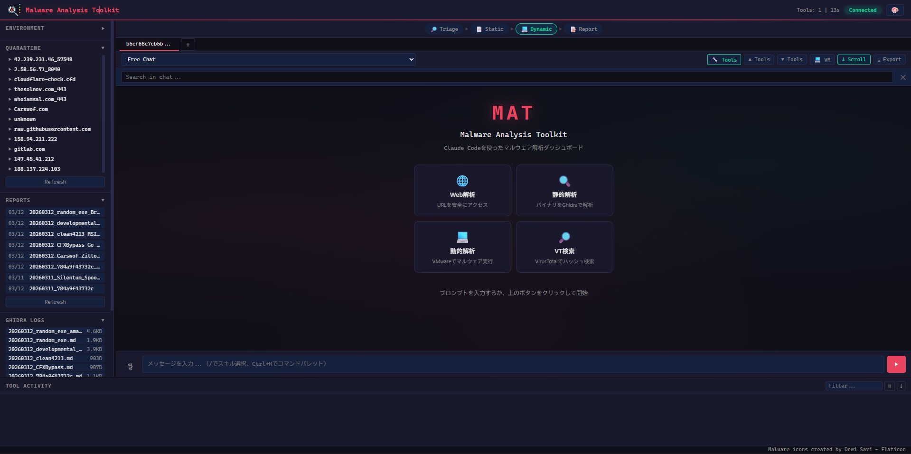
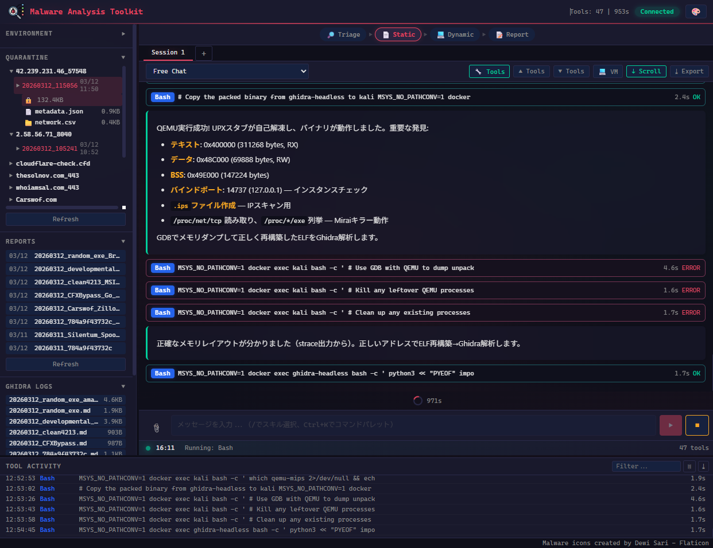

# claudecode-re-toolkit

**English** | [Japanese (日本語)](README_JP.md)

Reverse engineering & malware analysis toolkit for [Claude Code](https://claude.com/claude-code) — integrating static analysis, dynamic analysis, and web forensics through Claude Code skills.

## Features

| Skill | Description | Backend |
|-------|-------------|---------|
| **malware-fetch** | Safe access to malicious websites with full forensic capture, C2 profiling, ClickFix detection, OTX/VT/MB/TF threat intel | Docker (Chromium + Playwright) |
| **ghidra-headless** | Automated static analysis with Ghidra (decompile, imports, strings, YARA, CAPA, FLOSS, oletools, .NET decompile), 8-phase `analyze-full` pipeline with auto-fallback, targeted decompilation, deep static analysis (encoded payload extraction, kernel driver analysis, Authenticode verification, PDB extraction), ZIP archive support, maldev technique detection | Docker (Ghidra 12.1.3 + Kali/radare2 + ILSpy) |
| **malware-sandbox** | Dynamic malware analysis with VMware VM (3-level unpacking, Frida DBI, FakeNet, x64dbg-automate MCP remote debugging, DispatchLogger COM monitoring, dumpulator emulation, post-execution audit, C2 capture) | VMware Workstation |
| **threat-intel** | Unified OSINT client over 18 services (VT, HA, Triage, Bazaar, ThreatFox, OTX, URLHaus, URLScan.io, Shodan, AbuseIPDB, GreyNoise, IPInfo, BGPView, Whois/RDAP, NIST, VulnCheck, Malpedia, Malshare). Cross-service hash/IP correlation, VT behavior sandbox analysis, IOC extract (txt/pdf/eml/url, SSRF defended), MITRE ATT&CK, HTML/PDF reports | Python (requests + SQLite cache) |
| **toolkit-setup** | Interactive setup wizard for .env, Docker builds, YARA/CAPA/FLOSS/oletools/dumpulator, and VMware config | — |

## Architecture

```
┌─────────────────────────────────────────────────┐
│                  Claude Code                     │
│              (AI-driven orchestration)           │
├───────────────┬───────────────┬─────────────────┤
│  malware-fetch    │ ghidra-headless│ malware-sandbox  │
│  (Docker)     │  (Docker)     │  (VMware VM)    │
├───────────────┼───────────────┼─────────────────┤
│ • Screenshot  │ • Decompile   │ • Unpacking     │
│ • HTML save   │ • Imports     │ • Frida DBI     │
│ • Downloads   │ • Strings     │ • FakeNet C2    │
│ • VT/MB/TF/OTX│ • YARA/CAPA   │ • PE-sieve      │
│ • AES encrypt │ • IOC extract │ • Memory dump   │
│ • Tor support │ • Classify    │ • x64dbg MCP    │
│ • C2 profiling│ • .NET decomp │ • DispatchLogger │
│ • ClickFix    │ • ZIP support │ • COM monitor   │
├───────────────┴───────────────┴─────────────────┤
│              threat-intel (Python)               │
│  VT • HA • Triage • Bazaar • ThreatFox • OTX   │
│  URLHaus • Shodan • AbuseIPDB • GreyNoise • ... │
└─────────────────────────────────────────────────┘
```

## Quick Start

### Prerequisites

- **Windows 10/11** (Linux/macOS is not officially supported)
- [Claude Code](https://claude.com/claude-code) installed
- Docker Desktop running
- [VMware Workstation Pro](https://www.vmware.com/products/desktop-hypervisor/workstation-and-fusion) (malware-sandbox skill requires vmrun CLI)
- Go 1.26+ (only to rebuild the bundled Go tools from source — prebuilt `.exe` files ship in the repo)
- Python 3.10+

### Setup

#### Automated (Recommended)

```bash
git clone https://github.com/HiyokoSauna37/claudecode-re-toolkit.git
cd claudecode-re-toolkit
claude
# Then say: "setup" or "/toolkit-setup"
```

The **toolkit-setup** skill guides you through the entire setup interactively — .env creation, Docker image builds, YARA/CAPA installation, and VMware configuration. Choose between an interactive wizard (step-by-step) or batch mode (plan-then-execute).

#### Manual

```bash
# Clone
git clone https://github.com/HiyokoSauna37/claudecode-re-toolkit.git
cd claudecode-re-toolkit

# Environment variables
cp .env.example .env
# Edit .env with your API keys and passwords

# Build Docker images
docker build -t malware-fetch-browser:latest tools/malware-fetch/
docker compose -f tools/ghidra-headless/docker-compose.yml up -d

# VMware sandbox setup (see docs)
# tools/malware-sandbox/docs/VM-SETUP.md
```

Pre-built Windows binaries (malware-fetch.exe, vmrun-wrapper.exe, etc.) are included in the repository. No Go build required.

### Environment Variables (.env)

Copy `.env.example` to `.env` and configure:

| Variable | Description | Required for |
|----------|-------------|-------------|
| `QUARANTINE_PASSWORD` | Password for AES-256-CBC encryption of downloaded malware files. Set any strong password. | malware-fetch |
| `VIRUSTOTAL_API_KEY` | VirusTotal API key ([free tier](https://www.virustotal.com/gui/join-us) available). Used for hash lookups and behavior analysis. | malware-fetch (`check` / `behavior` / `lookup`) |
| `ABUSECH_AUTH_KEY` | [abuse.ch](https://auth.abuse.ch/) API key for MalwareBazaar / ThreatFox search. Optional — works without it but with rate limits. | malware-fetch (`bazaar` / `threatfox`, optional) |
| `VMRUN_PATH` | Full path to `vmrun.exe`. Example: `C:\Program Files (x86)\VMware\VMware Workstation\vmrun.exe` | malware-sandbox |
| `VM_VMX_PATH` | Full path to the VM's `.vmx` file. Example: `C:\VMs\Win10\Win10.vmx` | malware-sandbox |
| `VM_GUEST_USER` | Guest OS login username | malware-sandbox |
| `VM_GUEST_PASS` | Guest OS login password | malware-sandbox |
| `VM_GUEST_PROFILE` | Guest OS user profile directory. Example: `C:\Users\analyst` | malware-sandbox |
| `VM_SNAPSHOT` | Clean snapshot name to revert to after analysis (default: `clean_with_tools_fakenet_ca`) | malware-sandbox (optional) |
| `VMRUN_TIMEOUT` | Timeout in seconds for vmrun commands (default: `120`). Increase to `300` for large files (>50MB) | malware-sandbox (optional) |

> **Note:** malware-fetch and ghidra-headless only require `QUARANTINE_PASSWORD` and optionally the API keys. The `VM_*` variables are only needed if you use malware-sandbox.

### Usage with Claude Code

```bash
# Start Claude Code in the repository
claude

# Then use skills:
# "Analyze this URL for malware" → malware-fetch
# "Analyze this binary with Ghidra" → ghidra-headless
# "Run dynamic analysis on this packed binary" → malware-sandbox
```

## GUI Dashboard (Experimental)

A web-based GUI dashboard is available as an experimental frontend for the toolkit. It provides a chat interface powered by Claude Code subprocess, with real-time tool activity monitoring, quarantine file browser, report viewer, and more.




```bash
cd tools/gui-prototype
pip install fastapi uvicorn python-dotenv pyyaml
python server.py
# Open http://localhost:8765
```

**Features:**
- Chat interface with Claude Code (streaming, session management)
- Quarantine file browser with drag & drop analysis
- Report viewer with Markdown rendering
- Tool activity log with per-tool color coding
- VM Live View (VMware screenshot streaming)
- Pipeline indicator (Triage → Static → Dynamic → Report)
- Command palette (Ctrl+K), keyboard shortcuts
- Readability Tweaks panel (Density / Theme segmented controls, persisted via localStorage)
- Multiple themes (Forensic, Default, Claude, Cyber, Arctic, Amethyst, Light)
- Cancel button kills the entire Claude subprocess tree (taskkill /F /T on Windows) so node.exe + spawned tools stop together

> **Note:** This is a prototype under active development. Some features may be unstable.

## Typical Workflow

1. **Web Collection**: Use malware-fetch to safely visit malicious URLs and collect artifacts (encrypted into `Quarantine/`)
2. **Static Analysis**: Run `ghidra.sh analyze-full` (supports raw PE, `.enc.gz`, and `--zip-password` ZIP archives) — 8-phase pipeline with auto-fallback (Phase 0-7: PE Triage → FLOSS → binary-viz → YARA → CAPA → Ghidra decompile → IOC extract → Classify; oletools auto-fires for Office documents; PE fallback auto-generates strings/imports if Ghidra fails)
3. **Deep Static Analysis**: Targeted decompilation of key functions, encoded payload extraction (multi-layer Base64/Hex decode), embedded PE analysis (kernel drivers, Authenticode verification, PDB path extraction)
4. **Static → Dynamic Bridge**: `static_hints.py` reads the Ghidra output and emits ready-to-paste Frida hook targets, FakeNet rules, and Procmon filters for the next phase
5. **Dynamic Analysis**: For packed/obfuscated samples, use malware-sandbox (`analyze` / `unpack auto` / `frida-analyze`). x64dbg-automate MCP for anti-VM bypass (function skip technique)
6. **Post-Execution Audit**: `audit-security` / `audit-persistence` / `audit-infosteal` for before/after diff. `capture-c2` for TLS SNI domain collection
7. **Config Extraction**: After memdump, `dumpulator_extractor.py` emulates the dump on the host to pull C2 IOCs without re-running the malware
8. **Threat-Intel Correlation**: `correlate-hash` for multi-service lookup, `vt behavior` for sandbox verdict and framework identification (WinosStager, ValleyRAT, Terminator, etc.)
9. **Re-analysis**: Analyze unpacked binaries with ghidra-headless for full decompilation

## Security

- All malware downloads are AES-256-CBC encrypted inside Docker containers
- VM dynamic analysis runs in network-isolated (Host-Only) mode
- **Never decrypt malware on the host OS** — always decrypt inside Docker/VM
- Quarantine and output directories are gitignored

## Tool Details

### malware-fetch

Go-based CLI tool for safe web forensics:
- Docker-isolated Chromium browser
- Automatic AES-256 encryption of all downloads (including `fetch` output, for Defender evasion)
- VirusTotal, MalwareBazaar, ThreatFox, OTX integration
- C2 auto-profiling (VT + ThreatFox + OTX + Passive DNS + port scan)
- Cluster-wide C2 profiling via `c2cluster.py` (ThreatFox tag expansion, fingerprint-based hunting)
- Threat-intel tool suite under `tools/malware-fetch/intel/` — `c2hunt`, `threatfeed`, `iocminer`, `loghunter`, `intel` dispatcher, `hunt-report.exe` (Go aggregator)
- ClickFix detection and JS deobfuscation (`js_deobfuscate.py --url` for disk-less analysis)
- ClearFake Polygon-blockchain C2 decoder (`clearfake_decode.py`)
- Network log classification (BLOCKCHAIN_RPC, C2_API, TRACKER, etc.)
- Batch domain probing for large-scale IOC triage
- Preflight check for Docker daemon and ThreatFox `--limit N` support (up to 1000)
- Tor proxy support
- Directory listing parser for C2 servers

### ghidra-headless

Docker-based Ghidra automation:
- **8-Phase `analyze-full` pipeline** (Phase 0-7): PE Triage → FLOSS → binary-viz → YARA → CAPA → Ghidra decompile → IOC extract → malware classify (sequential, single command). oletools is inserted as Phase 2b when an Office document is detected. Auto-fallback with `pe_fallback_extract.py` when Ghidra scripts fail — IOC/classification continues via pefile-based extraction.
- **ZIP archive support**: `analyze-full --zip-password infected sample.zip` — extracts inside the container (never on host), selects the largest file, and runs the full pipeline
- **Maldev technique detection** (`maldev-detect`): 18 operator-tier techniques (PEB walking, ROR13/FNV-1a hashing, Process Hollowing, Early Bird APC, Direct Syscalls, Reflective DLL, inline AES, VM detection hardware/software fingerprint, time-based evasion, etc.) with ATT&CK mapping. `scan-binary` mode runs in 5 seconds without Ghidra.
- **Anti-VM binary patcher** (`binary_patcher.py`): Patches VM-detection strings in malware binaries (VMware drivers, CPUID vendor IDs, MAC prefixes) to bypass sandbox evasion. Supports `--auto-vm` (auto-detect known patterns), `--patch-string` (find/replace), and `--patch` (hex offset). Runs inside Docker container only.
- **Re-encryption** (`ghidra.sh encrypt`): Re-encrypts patched binaries back to `.enc.gz` quarantine format for safe VM transfer
- Full binary analysis (info, imports, exports, strings, functions, xrefs, decompile)
- .NET binary decompilation via ILSpy CLI (dotnet-decompile, dotnet-metadata, dotnet-types) — backed by a separate `dotnet-decompiler` image shared between containers
- PE Triage (Phase 0) with packer detection and entropy analysis
- **FLOSS string deobfuscation** (`floss_analyzer.py`) — extracts stack strings, tight-loop XOR/ROT strings, and emulation-decoded strings that plain string extraction misses
- **Office malware analysis** (`office_analyzer.py`) — oletools wrapper for VBA macros, OLE streams, RTF/DDE payloads in `.doc`/`.xls`/`.ppt`/`.docx`/`.rtf`/`.msg`
- **Binary visualization** (`binary_viz.py`) — entropy profile + bigram heatmap + byte histogram PNGs for at-a-glance packer assessment
- YARA scanning with signature-base and yara-forge rules
- Mandiant CAPA capability analysis with MITRE ATT&CK mapping
- IOC extraction (IP, domain, URL, hash, registry keys)
- Malware classification (InfoStealer, Ransomware, RAT, Dropper, Loader, Worm)
- Analyzer + Reviewer agent team for quality-assured analysis sessions
- Kali Linux container with radare2 for quick triage, entropy analysis, crypto detection, and binary diffing
- **Go binary analysis**: Specialized workflow for Go-compiled malware (gopclntab-aware string extraction, module/symbol analysis). Go binaries have minimal PE imports but rich embedded strings recoverable via raw extraction
- **Targeted decompilation** (`decompile_function.py`) — decompile specific functions by offset, name, or address range. Supports mixed specifiers (e.g. `0xc8d0 FUN_18000a8a0 0xc000-0xd000`)
- **Wide string extraction** (`extract_string.py`) — extract full wide strings at arbitrary virtual addresses (for recovering encoded payloads truncated in strings output)
- **Deep static analysis workflow** — multi-layer payload decoding (Base64→Base64→Hex→PE), kernel driver analysis, Authenticode signature verification, PDB path extraction, threat-intel hash correlation. See `references/deep-static-analysis.md`
- Helper scripts: `lnk-parser.py` (LNK triage), `pe-encrypt.py` (.enc.gz generator for VM transfer), `chunk-extract.py` (.rdata embedded binary extraction), `pe_fallback_extract.py` (Ghidra-independent strings/imports for IOC pipeline), `binary_patcher.py` (anti-VM string neutralization)
- Scripts volume-mounted for instant hot-reload (no Docker rebuild needed for script edits)
- Automatic command logging — every `ghidra.sh` invocation appends to `tools/ghidra-headless/logs/YYYYMMDD_<target>.md`; review with `ghidra.sh log-show <binary>`

### malware-sandbox

VMware Workstation VM automation:
- One-command `analyze` workflow that auto-handles snapshot revert, Host-Only network isolation, malware copy, pre/post snapshots, HollowsHunter scan, and final revert (no manual `start` / `net-isolate` needed). `--anti-vm` flag auto-applies VMX hardening (CPUID/SMBIOS/MAC spoofing) before VM start
- 3-Level Unpacking System (memdump-racer → TinyTracer → mal_unpack, with an x64dbg fallback procedure)
- Frida DBI with anti-debug bypass and memory dumping (with preflight check for guest Frida install)
- DispatchLogger COM monitoring for script-based malware (VBS, JS, HTA, PowerShell, Office macros)
- FakeNet-NG integration for C2 protocol capture, with `fakenet_validate.py` config validator and `build_http_response.py` response builder
- **`dumpulator_extractor.py`** — emulates a process minidump on the host (via unicorn/dumpulator) to pull strings, IOCs, and call specific RVAs (e.g. config decryption routines) without re-running the malware
- **`static_hints.py`** — reads ghidra-headless output and emits Frida hook targets, FakeNet rules, Procmon filters, and recommended `sandbox.sh` commands (closes the static→dynamic feedback loop)
- **`sandbox-evasion-check.exe`** — runs inside the VM to surface software-level analysis indicators (small disk, low RAM, recent uptime, analyst processes) that malware uses to bail
- **`vm-detect-checker.exe`** — runs inside the VM to enumerate hardware-level VMware fingerprints (SMBIOS, ACPI, MAC OUI) that VMProtect/Themida key off
- **x64dbg-automate MCP** — remote debugging via ZeroMQ. Function skip bypass for anti-VM checks, breakpoint management, register manipulation. See guides/x64dbg-mcp-guide.md for operational details
- **Post-execution audit** (`audit-security`, `audit-persistence`, `audit-infosteal`) — JSON-based before/after diff of Defender state, registry persistence, browser credential access, and TEMP file creation (5-min window)
- **C2 capture** (`capture-c2`) — automated NAT + TLS SNI monitoring + malware execution + result collection + network re-isolation cycle
- `regshot_diff.py` for pre/post registry diffing
- Network isolation management
- Comprehensive guest tool suite (x64dbg, PE-sieve, HollowsHunter, mal_unpack, etc.)
- Automatic `.enc.gz` quarantine decryption inside the VM (host never touches raw malware)
- BOM-less UTF-8 script deployment and `Start-Process`-based persistent tool launching to avoid vmrun hangs

## Helper Tools (standalone)

These ship as standalone binaries / containers and are invoked outside the three main skills:

- **`tools/quarantine/quarantine.exe`** — Quarantine browser CLI: `quarantine list` / `info <#|domain>` / `analyze <#|domain>` (decrypt + ghidra `analyze-full` in one shot). Gives you an at-a-glance view of what malware-fetch has captured without scripting around `.enc.gz`.
- **`tools/mergen/mergen.sh`** — VMProtect devirtualization via LLVM IR lifting. Lifts protected functions to LLVM IR for human-readable analysis when malware-sandbox unpacking can't reach the original code.
- **`tools/dotnet-decompiler/`** — ILSpy CLI Docker image. Auto-pulled by `ghidra.sh dotnet-decompile`; can also be invoked directly for batch .NET workflows.

## Credits

This toolkit orchestrates excellent third-party tools. Their authors deserve the credit.

**Guest analysis tools**
- [pe-sieve](https://github.com/hasherezade/pe-sieve), [hollows_hunter](https://github.com/hasherezade/hollows_hunter), [mal_unpack](https://github.com/hasherezade/mal_unpack), [tiny_tracer](https://github.com/hasherezade/tiny_tracer) — hasherezade (BSD-2-Clause)
- [x64dbg](https://github.com/x64dbg/x64dbg) (GPL-3.0), [ScyllaHide](https://github.com/x64dbg/ScyllaHide)
- [Frida](https://frida.re/) (wxWindows Library Licence), [FakeNet-NG](https://github.com/mandiant/flare-fakenet-ng) (Apache-2.0)
- [Sysinternals Process Monitor](https://learn.microsoft.com/sysinternals/downloads/procmon)

**Static analysis**
- [Ghidra](https://github.com/NationalSecurityAgency/ghidra) — NSA (Apache-2.0)
- [capa](https://github.com/mandiant/capa), [FLOSS](https://github.com/mandiant/flare-floss) — Mandiant (Apache-2.0)
- [YARA](https://github.com/VirusTotal/yara) (BSD-3-Clause), [signature-base](https://github.com/Neo23x0/signature-base), [YARA Forge](https://github.com/YARAHQ/yara-forge)

**Threat intelligence** — VirusTotal, Hybrid Analysis, Triage, abuse.ch (MalwareBazaar / ThreatFox / URLHaus), AlienVault OTX, URLScan.io, Shodan, AbuseIPDB, GreyNoise, IPInfo, BGPView, NIST NVD, VulnCheck, Malpedia, Malshare

**Pointers that shaped this toolkit** — [@duty_1g](https://x.com/duty_1g) (x64dbg MCP ecosystem), [@PINKSAWTOOTH](https://x.com/PINKSAWTOOTH) (Ghidra's adoption of [x64dbg-automate](https://github.com/dariushoule/x64dbg-automate) by Darius Houle), [@MalwareBibleJP](https://x.com/MalwareBibleJP) (PE-sieve). See [reports/writeups/20260824_x64dbg-mcp-evaluation.md](reports/writeups/20260824_x64dbg-mcp-evaluation.md).

## License

MIT License
