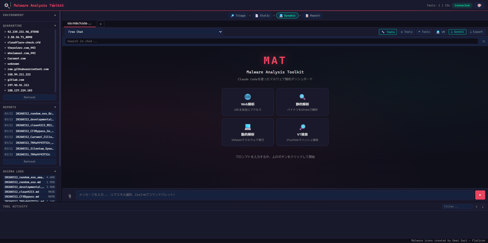
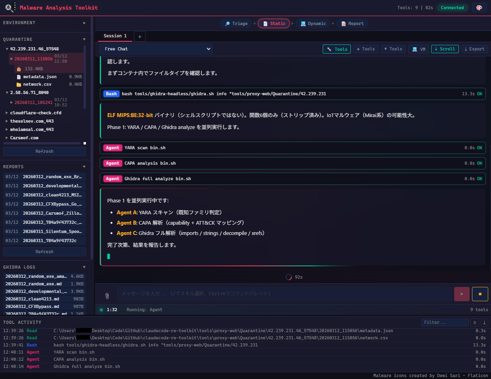

# claudecode-re-toolkit

[English](README.md) | **Japanese**

[Claude Code](https://claude.com/claude-code) を利用したリバースエンジニアリング・マルウェア解析ツールキット。静的解析、動的解析、Webフォレンジックを Claude Code のスキルとして統合。

## 機能一覧

| スキル | 概要 | バックエンド |
|--------|------|-------------|
| **proxy-web** | 悪性Webサイトへの安全なアクセスとフォレンジックデータ取得 | Docker (Chromium + Playwright) |
| **ghidra-headless** | Ghidra による自動静的解析（デコンパイル、インポート、文字列、YARA、CAPA） | Docker (Ghidra 12.0.3 + Kali/radare2) |
| **vmware-sandbox** | VMware VM を使ったマルウェア動的解析（アンパック、Frida DBI、FakeNet） | VMware Workstation |
| **toolkit-setup** | .env作成、Dockerビルド、YARA/CAPA、VMware設定の対話型セットアップウィザード | — |

## アーキテクチャ

```
┌─────────────────────────────────────────────────┐
│                  Claude Code                     │
│              (AI駆動オーケストレーション)           │
├───────────────┬───────────────┬─────────────────┤
│  proxy-web    │ ghidra-headless│ vmware-sandbox  │
│  (Docker)     │  (Docker)     │  (VMware VM)    │
├───────────────┼───────────────┼─────────────────┤
│ • スクリーンショット│ • デコンパイル │ • アンパック    │
│ • HTML保存    │ • インポート   │ • Frida DBI     │
│ • ダウンロード │ • 文字列抽出   │ • FakeNet C2    │
│ • VT/MB/TF    │ • YARA/CAPA   │ • PE-sieve      │
│ • AES暗号化   │ • IOC抽出     │ • メモリダンプ   │
│ • Tor対応     │ • 自動分類     │ • x64dbg        │
└───────────────┴───────────────┴─────────────────┘
```

## クイックスタート

### 前提条件

- **Windows 10/11**（Linux/macOS は未サポート）
- [Claude Code](https://claude.com/claude-code) インストール済み
- Docker Desktop 起動済み
- [VMware Workstation Pro](https://www.vmware.com/products/desktop-hypervisor/workstation-and-fusion)（vmware-sandbox スキルに必要、vmrun CLI 利用）
- Python 3.10+

### セットアップ

#### 自動セットアップ（推奨）

```bash
git clone https://github.com/HiyokoSauna37/claudecode-re-toolkit.git
cd claudecode-re-toolkit
claude
# 「セットアップして」 または 「/toolkit-setup」 と入力
```

**toolkit-setup** スキルが .env 作成、Docker イメージビルド、YARA/CAPA インストール、VMware 設定までを対話的にガイドします。対話型ウィザード（1ステップずつ確認）と一括モード（計画提示→一気に実行）を選択可能。

#### 手動セットアップ

```bash
# クローン
git clone https://github.com/HiyokoSauna37/claudecode-re-toolkit.git
cd claudecode-re-toolkit

# 環境変数の設定
cp .env.example .env
# .env を編集して各パラメータを設定（下記テーブル参照）

# Docker イメージのビルド
docker build -t proxy-web-browser:latest tools/proxy-web/
docker compose -f tools/ghidra-headless/docker-compose.yml up -d

# VMware sandbox のセットアップ（ドキュメント参照）
# tools/vmware-sandbox/docs/VM-SETUP.md
```

ビルド済み Windows バイナリ（proxy-web.exe、vmrun-wrapper.exe 等）はリポジトリに同梱済み。Go のインストールは不要。

### 環境変数 (.env)

`.env.example` を `.env` にコピーして設定:

| 変数名 | 説明 | 必要なスキル |
|--------|------|-------------|
| `QUARANTINE_PASSWORD` | ダウンロードしたマルウェアの AES-256-CBC 暗号化パスワード。任意の強力なパスワードを設定。 | proxy-web |
| `VIRUSTOTAL_API_KEY` | VirusTotal API キー（[無料枠](https://www.virustotal.com/gui/join-us)あり）。ハッシュ検索・振る舞い分析に使用。 | proxy-web (`check` / `behavior` / `lookup`) |
| `ABUSECH_AUTH_KEY` | [abuse.ch](https://auth.abuse.ch/) API キー（MalwareBazaar / ThreatFox 検索用）。なくても動作するがレート制限あり。 | proxy-web (`bazaar` / `threatfox`、任意) |
| `VMRUN_PATH` | `vmrun.exe` のフルパス。例: `C:\Program Files (x86)\VMware\VMware Workstation\vmrun.exe` | vmware-sandbox |
| `VM_VMX_PATH` | VM の `.vmx` ファイルのフルパス。例: `C:\VMs\Win10\Win10.vmx` | vmware-sandbox |
| `VM_GUEST_USER` | ゲスト OS のログインユーザー名 | vmware-sandbox |
| `VM_GUEST_PASS` | ゲスト OS のログインパスワード | vmware-sandbox |
| `VM_GUEST_PROFILE` | ゲスト OS のユーザープロファイルディレクトリ。例: `C:\Users\analyst` | vmware-sandbox |
| `VM_SNAPSHOT` | 解析後に復帰するクリーンスナップショット名（デフォルト: `clean_with_tools`） | vmware-sandbox（任意） |
| `VMRUN_TIMEOUT` | vmrun コマンドのタイムアウト秒数（デフォルト: `30`） | vmware-sandbox（任意） |

> **補足:** proxy-web と ghidra-headless は `QUARANTINE_PASSWORD` と API キー（任意）のみで利用可能。`VM_*` 変数は vmware-sandbox を使う場合のみ必要。

### Claude Code での使い方

```bash
# リポジトリで Claude Code を起動
claude

# スキルの利用例:
# 「このURLをマルウェア解析して」 → proxy-web
# 「このバイナリをGhidraで解析して」 → ghidra-headless
# 「このパック済みバイナリを動的解析して」 → vmware-sandbox
```

## GUI ダッシュボード（実験的）

ツールキットの Web ベース GUI ダッシュボードを実験的に提供しています。Claude Code のサブプロセスによるチャットインターフェースで、リアルタイムのツール活動モニタリング、Quarantine ファイルブラウザ、レポートビューアなどを備えています。




```bash
cd tools/gui-prototype
pip install fastapi uvicorn python-dotenv pyyaml
python server.py
# http://localhost:8765 を開く
```

**主な機能:**
- Claude Code とのチャットインターフェース（ストリーミング、セッション管理）
- Quarantine ファイルブラウザ（ドラッグ&ドロップで解析指示）
- Markdown 対応レポートビューア
- ツール別カラーコード付きアクティビティログ
- VM Live View（VMware スクリーンショットストリーミング）
- パイプラインインジケーター（Triage → Static → Dynamic → Report）
- コマンドパレット（Ctrl+K）、キーボードショートカット
- 複数テーマ（Default、Claude、Cyber、Arctic、Amethyst、Light）

> **注意:** 開発中のプロトタイプです。一部の機能が不安定な場合があります。

## 典型的なワークフロー

1. **Web収集**: proxy-web で悪性URLに安全にアクセスし、アーティファクトを取得
2. **静的解析**: ghidra-headless でダウンロードしたバイナリを解析（YARA、CAPA、デコンパイル）
3. **動的解析**: パック/難読化された検体は vmware-sandbox でランタイム解析
4. **再解析**: アンパック後のバイナリを ghidra-headless で再度デコンパイル

## セキュリティ

- マルウェアのダウンロードファイルは Docker コンテナ内で AES-256-CBC 暗号化
- VM 動的解析はネットワーク隔離（Host-Only）モードで実行
- **ホスト OS 上でマルウェアを復号化しないこと** — 必ず Docker/VM 内で復号
- Quarantine / output ディレクトリは gitignore 設定済み

## ツール詳細

### proxy-web

Go 製 CLI ツールによる安全な Web フォレンジック:
- Docker 隔離された Chromium ブラウザ
- 全ダウンロードファイルの自動 AES-256 暗号化
- VirusTotal、MalwareBazaar、ThreatFox 連携
- Tor プロキシ対応
- C2 サーバーのディレクトリリスティング解析

### ghidra-headless

Docker ベースの Ghidra 自動解析:
- フルバイナリ解析（info、imports、exports、strings、functions、xrefs、decompile）
- signature-base / yara-forge ルールによる YARA スキャン
- Mandiant CAPA によるケイパビリティ分析 + MITRE ATT&CK マッピング
- IOC 自動抽出（IP、ドメイン、URL、ハッシュ、レジストリキー）
- マルウェア種別自動分類（InfoStealer、Ransomware、RAT、Dropper、Loader、Worm）
- Kali Linux コンテナの radare2 による高速トリアージ、エントロピー分析、暗号定数検出、バイナリ差分比較

### vmware-sandbox

VMware Workstation VM 自動操作:
- 3段階アンパックシステム（memdump-racer → TinyTracer → x64dbg）
- Frida DBI によるアンチデバッグ回避 + メモリダンプ
- FakeNet-NG 連携による C2 プロトコルキャプチャ
- ネットワーク隔離管理
- 包括的なゲスト内ツール群（x64dbg、PE-sieve、HollowsHunter 等）

## ライセンス

MIT License
